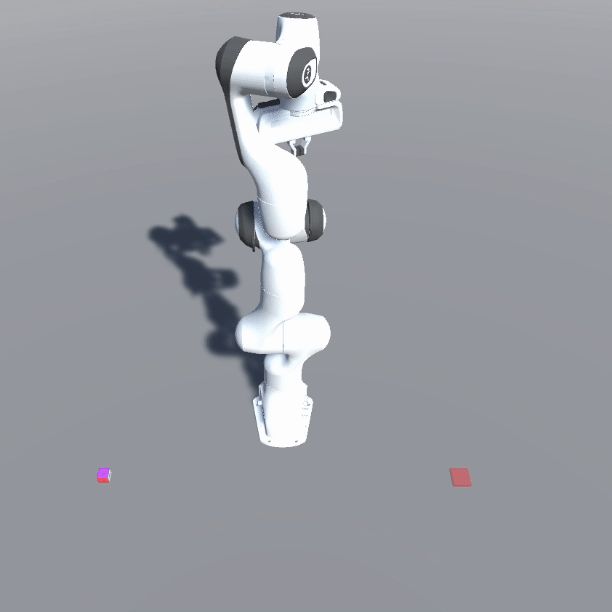
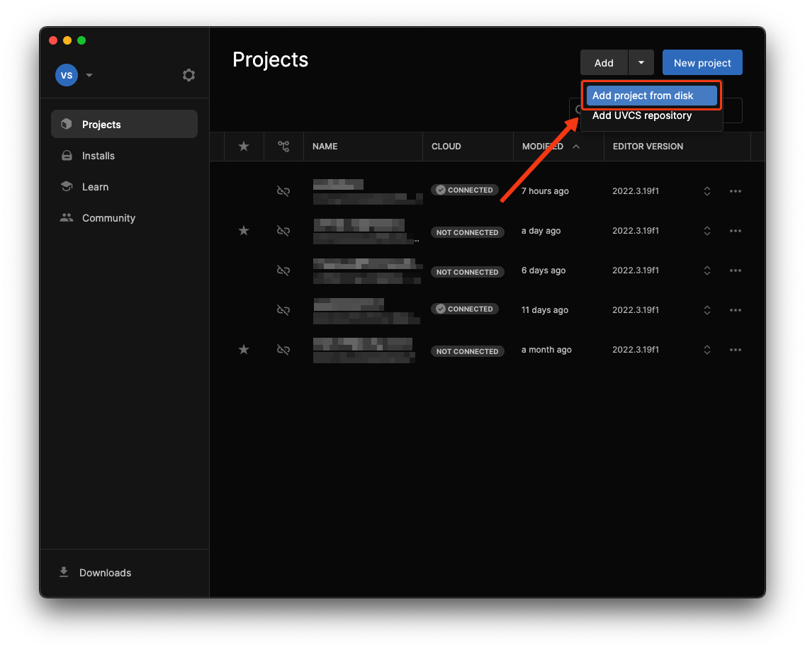
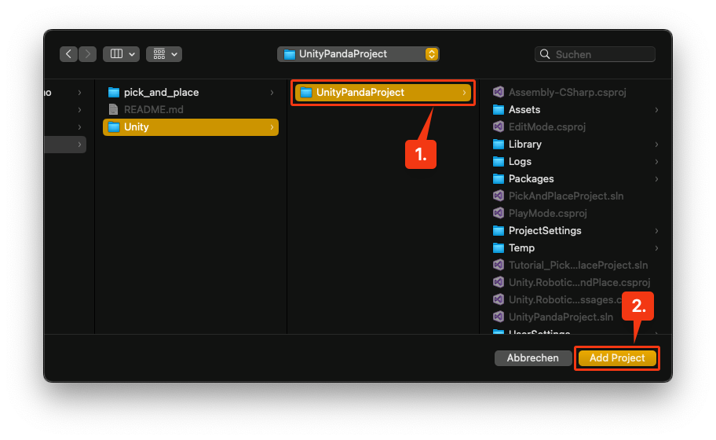
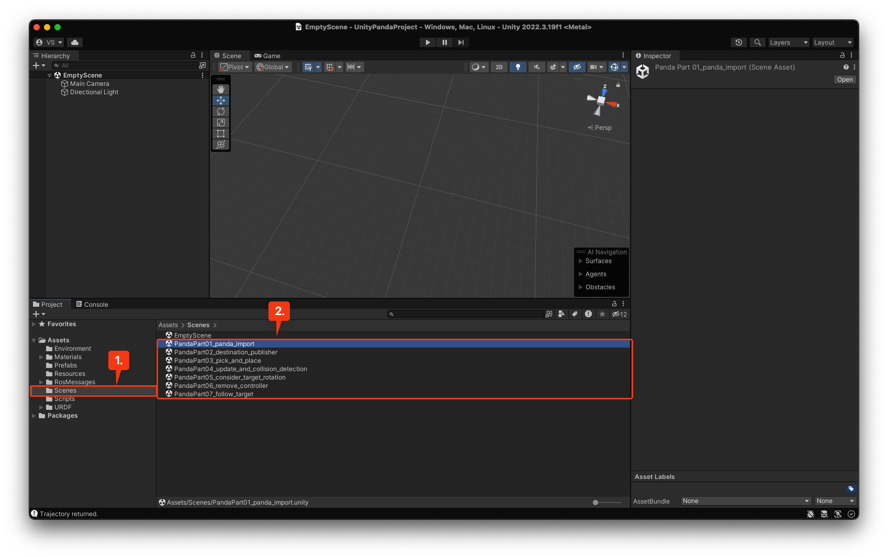
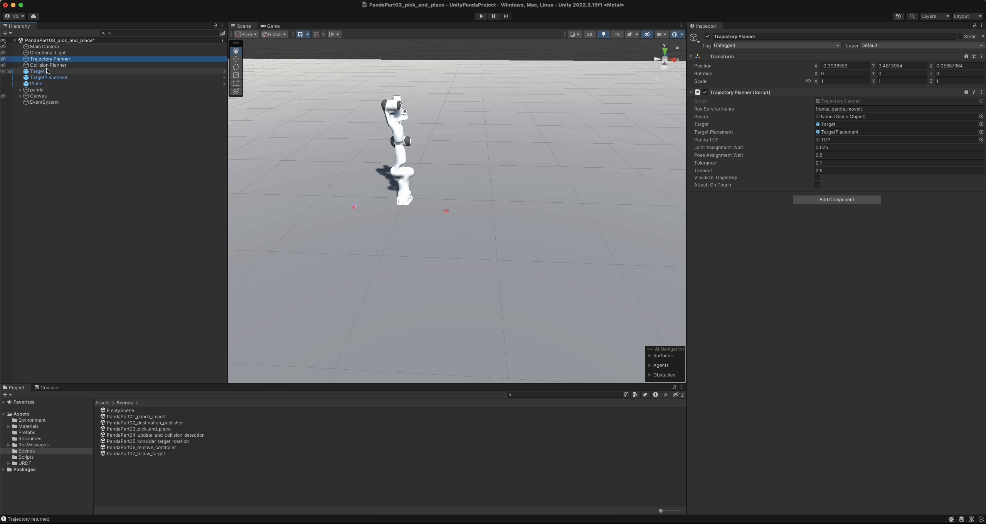
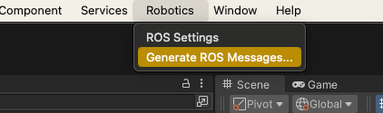
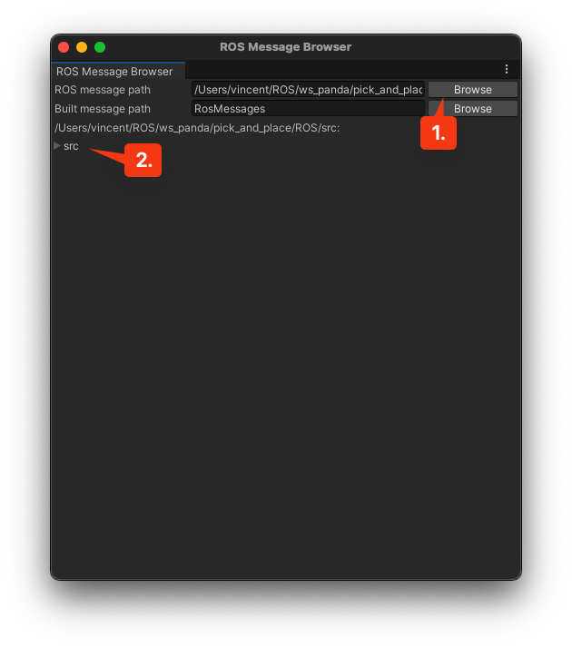
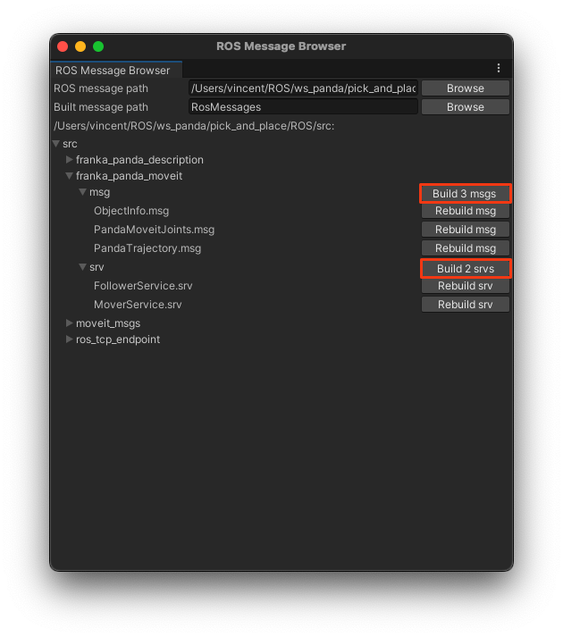
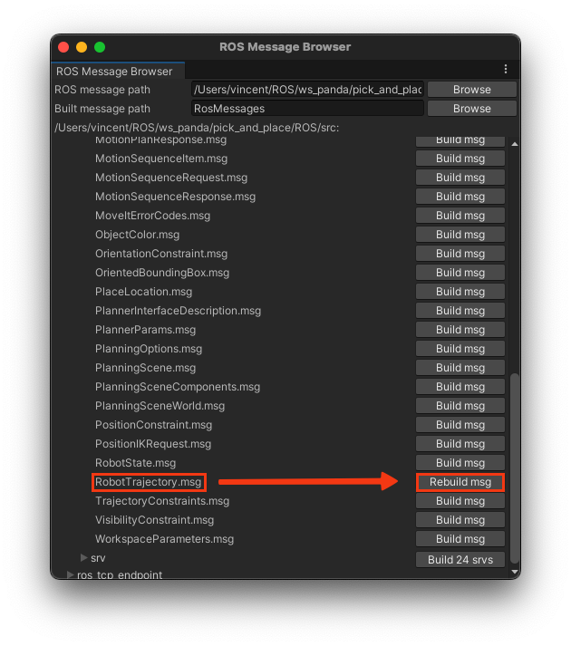

 

<p align="center"></p>

# ROS-Unity-Panda
This repository contains all files to simulate the Franka Emika Panda robotic arm-manipulator in Unity. It can be controlled via MTP using MoveIt 1.0! and ROS-Noetic. This is being achived with the help of the ROS-TCP-Connector ROS-package from Unity-Robotics-Hub. It aims to recreate the [pick and place tutorial](https://github.com/Unity-Technologies/Unity-Robotics-Hub/tree/main/tutorials/pick_and_place "Unity-Robotics-Hub") from Unity-Robotics-Hub as a starting point and adds functionality on that basis. To fully understand this documentation, reading their documentation is strongly advised.

---

## Table of Contents
1. [Credits](#credits)
2. [Installation](#installation)
3. [Setup](#setup)
4. [Launching](#launching)
5. [TODO](#todo)
[Addition Resources](#resources)

---

## 1. Credits <a name="credits"></a>
All used software and libarys are found in the [NOTICE](NOTICE).

> It also includes the Unity-Project used for demonstrating the work. The Unity Projec is build on top of the [Pick and Place Demo Project](https://github.com/Unity-Technologies/Unity-Robotics-Hub/tree/main/tutorials/pick_and_place "Unity-Robotics-Hub") from Unity-Robotics-Hub. It was heavily modified.

---

## 2. Installation <a name="installation"></a>

### I. Unity
To use this project, an installation of [Unity](https://unity.com/download "Download Unity") is needed. This project is build on Unity 2022.3.19f1 an should be compatible with every 2022 release (not tested).
> The URDF-Importer needs a Unity Editor version of [2020.2.0](https://unity3d.com/unity/whats-new/2020.2.0 "Unity whats new 2020.2.0")+

To use the project, the given Unity project can be used. For those who want to build the project from scratch, the [pick and place demo project](https://github.com/Unity-Technologies/Unity-Robotics-Hub/tree/main/tutorials/pick_and_place "Unity-Robotics-Hub") has a detailed installation guide.

### II. ROS
The project is build for ROS Noetic Ninjemys. Therefore, a fitting ROS instaltion is needed. 

#### Installing from source
Refer to the [ROS Noetic Documentation](http://wiki.ros.org/noetic "Noetic Ninjemys"). The project has been tested on MacOS 14.5 using the [RoboStack](https://robostack.github.io "robostack.github.io") bundeling and natively on Ubuntu 20.04. Other installations should work just as well.

#### Installing with docker
The documentation is under construction.
<!-- TODO: add this documentation -->

#### Finishing installation
<!-- TODO: add install script -->
<!-- TODO: update documentation -->
After having an up-to-date installtion of ROS Noetic, following steps must be completed:

1. Navigate to `<installation>/pick_and_place/ROS`.
   - This directory will be used as the [ROS catkin workspace](http://wiki.ros.org/catkin/Tutorials/using_a_workspace).
   - Copy or download this directory to your ROS operating system. This will not be needed if the ROS installation is on the same computer as the Unity installation.
    > Note: This contains the ROS packages for the pick-and-place task: *[ROS TCP Endpoint](https://github.com/Unity-Technologies/ROS-TCP-Endpoint)*, *[MoveIt Msgs](https://github.com/ros-planning/moveit_msgs)*, *franka_panda_moveit* and *franka_panda_description*.

2. The provided files require the following packages to be installed:
    For Ubuntu 20.04 users:
    ```bash
    sudo apt-get update && sudo apt-get upgrade
    sudo apt-get install python3-pip ros-noetic-robot-state-publisher ros-noetic-moveit ros-noetic-rosbridge-suite ros-noetic-joy ros-noetic-ros-control ros-noetic-ros-controllers
    sudo -H pip3 install rospkg jsonpickle
    ```
    For RoboStack users (here for MacOS):
    ```zsh
    mamba activate <yourenv>
    mamba install python3-pip ros-noetic-robot-state-publisher ros-noetic-moveit ros-noetic-rosbridge-suite ros-noetic-joy ros-noetic-ros-control ros-noetic-ros-controllers
    pip3 install rospkg jsonpickle
    ```
    > Mamba can be quite tricky to work with. You can always fall back to using conda, if it is installed. For a list of all available packages, see [available packages](https://robostack.github.io/noetic.html "RoboStack Noetic available packages").

3. Navigate to your ROS workplace, and run `catkin build && source devel/setup.bash`. Ensure there are no errors.

---

## 3. Setup <a name="setup"></a>
After Unity and ROS have been installed correctly, a simple project can be run to check the installation.

### I. Opening the Unity Project
To add the Project into Unity, click on `Add project from disk`.
<p align="center"></p>

Then navigate to your installation path. Choose the `UnityPandaProject` and click `Add Project`.
<p align="center"></p>

Unity will load up. In the `Project` view under `Assets` there is a `Scenes` folder. This folder contains all the examples that are currently possible with this project. This way of using the project skips all the tideous setup that is needed to get the scripts to work.
> For more information on how to apply this to other project or how to setup it up yourself, check out the [pick and place tutorial](https://github.com/Unity-Technologies/Unity-Robotics-Hub/tree/main/tutorials/pick_and_place "Unity-Robotics-Hub"). As mentioned often before, this documentation is heavly connected to the pick and place tutorial from Unity-Robotics-Hub.
<p align="center"></p>

After opening a scene, the serialised field propertys need to be populated for the scene to render. This is achived by dragging the needed gameObject into the serialised field. Hovering over a property gives a tooltip, which helps to find the correct GameObject. The naming makes it obvious what GameObject is needed tho.<br>
<p align="center"></p>

#### II. Building the ROS Messages
These should allready be build for the given project, but in case they're not, they can be build through the menu bar like this:
<p align="center"></p>

Next click `browse` and then navigate to `<installation>/pick_and_place/ROS/src` and chose that folder as the location. If you did everything correctly, you can see the dropdown `src`. Leave the build message path on RosMessages. That is the folder in the Assets, that the .cs files will be build into.
<p align="center"></p>

Open the `franka_panda_ros` dropdown and build all messages and services in there. These are custom made for this project. They exist on the ROS side aswell.

<p align="center"></p>

As a last step, open the movit_mgs `msg`dropdown and search for `RobotTrajectory.msg` and build this one too. The Unity side is now all set up and ready to go.
> Again this can be found in more detail with other messages and services in the [pick and place tutorial](https://github.com/Unity-Technologies/Unity-Robotics-Hub/tree/main/tutorials/pick_and_place "Unity-Robotics-Hub"). Understanding the setup there will help understanding what is being made here.

<p align="center"></p>

---

## 4. Launching <a name="launching"></a>
To launch a demo project, following steps are requiered:
1. Run the Unity project **UnityPandaProject**
2. On your ROS machine, navigte to `<installation>/ws_panda/pick_and_place/ROS`
2. Run the demo launchfile:
    ```
    source ./devel/setup.zsh #or setup.bash if you don't use zsh
    roslaunch franka_panda_moveit panda.launch
    ```
3. Start the Unity-Scene **PandaPart03_pick_and_place**
4. Press the **Publish** button in the gameview

> The robot should move to the **target**, pick it up and drop it at the **target placement** location. Make sure all the GameObjects are assined in the used scripts (drag and drop the GameObject in the corresponding box).

This general process is always the same for launching different demos. There are three launchfiles:
* `panda.launch` for basic pick and place (basic launchfile)
* `panda_collision.launch` for pick and place with collision detection (Scene `PandaPart04_update_and_collision_detection`)
* `panda_collision_follow.launch` for a follower implementation (Scene `PandaPart07_follow_target`)

---

## 5. TODO: <a name="todo"></a>
- [ ] Fix the FK of the panda and the drawing of the 3D splines
- [ ] Build an Interface for basic operation like `moveto()`, `moveto_grab()`, `moveto_place()` etc.
- [x] ~~fix the grabbing offset~~
- [x] ~~add visulization for the TCP path~~
- [x] ~~add the collision of the cube to MoveIt~~
- [x] ~~attach the target to the gripper to prevent the robot throwing the target (this is not a final fix)~~
- [x] ~~plan according to the orientation of the target, not use a fixed one~~
- [x] ~~optimize the grabbing algorithm to use the easier side to grab~~
- [x] ~~Update services to pass the `m_PickPoseOffset` varaible from Unity to ROS~~
- [x] ~~Fix a bug where MoveIt ignores the floor and plans its trajectory through it~~
- [x] ~~Containerise the entire project (Docker)~~
- [x] ~~Add AR support with the Meta-SDK (Quest 3)~~
- [x] ~~Include MTP/OPC-UA into the project~~
- [x] ~~Investigate the Unity to ROS coordinate transformation and fix a bug in the collision-sender related to that~~


---

## Additional Resources <a name="resources"></a>
- [ROS Installation](http://wiki.ros.org/ROS/Installation)
- [ROS Setup](http://wiki.ros.org/ROS/Tutorials/InstallingandConfiguringROSEnvironment)
- [Catkin](http://wiki.ros.org/catkin/Tutorials)
- [Getting started with Docker](https://docs.docker.com/get-started/)